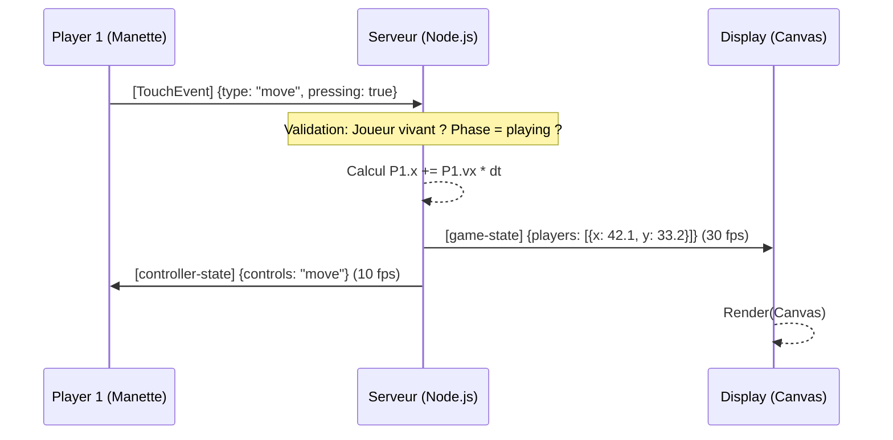
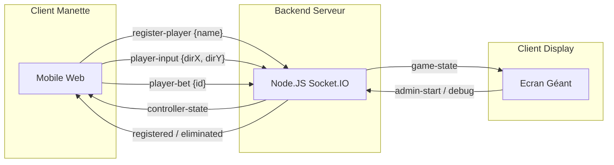
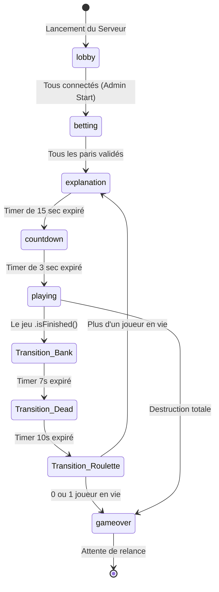
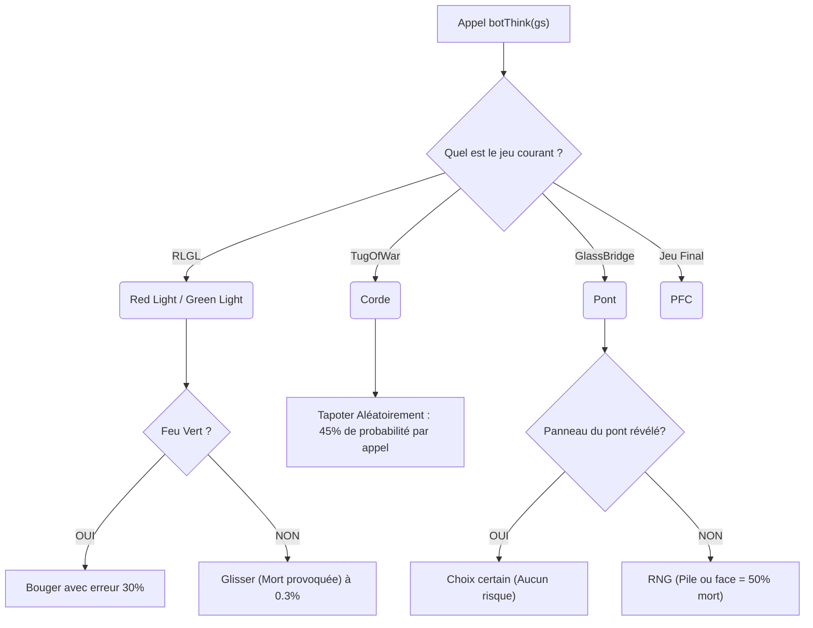
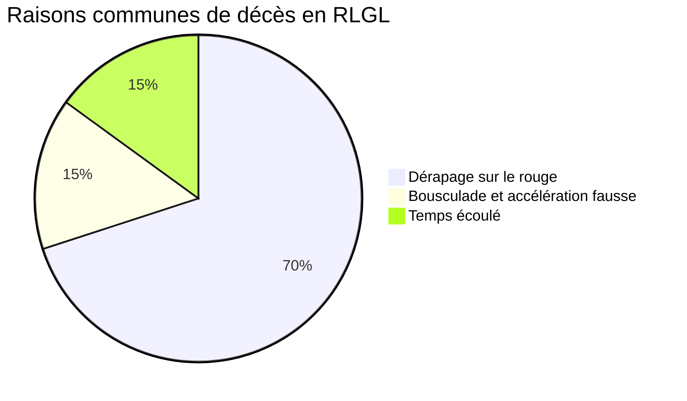
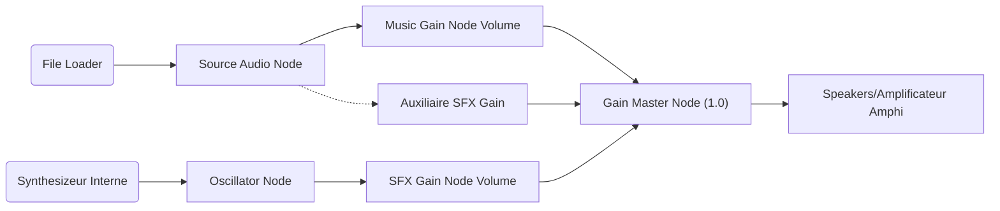

# 📖 Documentation Ultime & Détaillée — Squid Amphi

> **Auteurs du Projet** : JAHIER Maëlan, GRILLOT Thomas, SALLE-PIERRET Maxence  
> **Version du document** : 4.0.0 (Édition Intégrale, Graphes et Spécifications)  
> **Licence de code** : ISC / Open Source Universitaire

## Préambule
Ce document technique représente la ressource la plus exhaustive concernant l'architecture réseau, l'interface graphique, la couche de logique serveur physique et l'intégration du système "Squid Amphi". Ce projet simule une arène multijoueur synchrone sur navigateur, supportant jusqu'à 50 joueurs simultanés avec une résolution de `30 FPS` pour l'écran hôte, et `10 FPS` d'input pour réduire l'encombrement des routeurs WiFi (concept de client muet "Dumb Terminal").

---

## Sommaire Détaillé

1. [Topologie Réseau & Modèle Serveur-Autoritaire](#1-topologie-réseau--modèle-serveur-autoritaire)
2. [Structure Fonctionnelle de l'Arborescence](#2-structure-fonctionnelle-de-larborescence)
3. [Le Moteur Central : Server & GameManager](#3-le-moteur-central--server--gamemanager)
4. [La Classe Joueur et la Gestion Mathématique des Déplacements](#4-la-classe-joueur-et-la-gestion-mathématique-des-déplacements)
5. [Intelligence Artificielle Complète (Les Bots)](#5-intelligence-artificielle-complète-les-bots)
6. [Étude Approfondie des Mini-Jeux](#6-étude-approfondie-des-mini-jeux)
7. [Moteur Physique & Rendu Front-End (Le Déshabillage du Canvas)](#7-moteur-physique--rendu-front-end-le-déshabillage-du-canvas)
8. [Ingénierie Audio Réactive & Routage via API WebAudio](#8-ingénierie-audio-réactive--routage-via-api-webaudio)
9. [Interface Front-End Mobile (Controller tactile intelligent)](#9-interface-front-end-mobile-controller-tactile-intelligent)

---

## 1. Topologie Réseau & Modèle Serveur-Autoritaire

### 1.1 L'illusion du Multi-joueur (Dumb Terminals)

Une application multi-joueur gérant 50 clients tactiles ne peut pas se permettre d'être du Peer-To-Peer. Chaque téléphone enverrait `30 updates` par seconde, détruisant tout routeur WiFi. 
Le jeu implémente l'architecture du **Serveur Autoritaire (`Server-Authoritative Networking`)**.



1. **Serveur (GameManager / Node.js)** : Conserve en RAM (V8 Heap) la `Map` complète des joueurs. Il applique les règles, modifie les coordonnées X et Y à une virgule flottante près, gère l'avancée chronologique.
2. **Smartphones (Controller)** : L'interface tactile est une coquille vide ("Dumb Terminal"). Un téléphone intercepte le doigt posé (`touchstart`), et envoie de simples instructions. Il n'envoie JAMAIS "Je suis au pixel [X,Y]". Cela empêche toute tricherie.
3. **Le Display (Rendu Vidéo)** : Il s'agit d'un autre "Dumb Terminal", passif. Il écoute une boucle `setInterval()` serveur à 30 IPS et repeint l'écran.

### 1.2 Format des Payloads et Tables d'Événements

Voici le diagramme des échanges réseau gérés par Socket.io :



| Événement | Direction | Fréquence | Contenu |
|-----------|-----------|-----------|---------|
| `game-state` | Serveur ➔ Display | 30 Hz | Tableau des objets joueurs, compteurs de minuteries, liste des évènements d'animations, état de la phase en cours. |
| `controller-state` | Serveur ➔ Manettes | 10 Hz | Cible l'interface. `{ controls: "move", hp: 3 }` |
| `player-input` | Manettes ➔ Serveur | Asynchrone | Pression tactile `{ type: 'move', dirX: 1, dirY: 0.5, pressing: true }` |
| `player-bet` | Manettes ➔ Serveur | Asynchrone | Id de la carte cliquée en phase betting. |

---

## 2. Structure Fonctionnelle de l'Arborescence

```text
/server/                         -> Couche Métier Autoritaire
   index.js                      -> Bind du socket TCP sur Port 3000
   GameManager.js                -> L'automate à états finaux cadencé
   Player.js                     -> Entités physiques, vecteurs, interpolants
   BotPlayer.js                  -> Héritage direct, injectant une IA comportementale
   /games/                       -> Les mécaniques strictes des épreuves
      RedLightGreenLight.js      -> "123 Soleil" (Déplacements XY purs)
      TugOfWar.js                -> "Tir à la Corde" (Parité impaire et math linéaire)
      GlassBridge.js             -> "Pont de Verre" (Logique d'arbres FiLo asynchrone)
      RockPaperScissors.js       -> "Pierre Feuille Ciseau" (Algorithmes de brackets 2^n)

/public/                         -> Couche Présentation (Rendu et Capture d'Input)
   /display/
      index.html                 -> L'écran principal géant de projection
      display.js                 -> Le chef d'orchestre des écrans (CSS classes switcher)
      renderer.js                -> Le Canvas Graphic Pipeline Rendering
      sounds.js                  -> Le moteur WebAudio avec CrossFading Multi-Noeuds
   /controller/
      index.html                 -> Front du téléphone (Mobile first)
      controller.js              -> Gestion des TouchEvents natifs (sans 300ms delay)
   /audio/                       -> Effets bruts (Tick, Fusil, OSTs)
   /css/                         -> Décorations (Glassmorphism, Animations CSS)
```

---

## 3. Le Moteur Central : Server & GameManager

Le `GameManager` (~700 lignes) coordonne tout le flot logique. Son horloge interne bat à environ 33.3ms.

### 3.1 La Boucle Majeure et Le Delta Time (`dt`)
```javascript
setInterval(() => this.gameLoop(), 1000 / 30); // 33.3ms Update Step
```
Le serveur utilise `Date.now()` pour déterminer un **Delta Time (dt)** réel :
`let dt = (now - this.lastUpdate) / 1000;`
Ce "dt" permet aux calculs mathématiques (comme `x = x + vitesse * dt`) d'être parfaits même si le processeur du serveur lague (par exemple, un Garbage Collection lourd de Node.JS). C'est la garantie d'une simulation Isotropique et Déterministe.

### 3.2 Machine d'État Fini (FSM - Finite State Machine)

L'automate d'état du serveur définit l'évolution globale de la partie.



### 3.3. Gestion Algorithmique des Cagnottes et Pronostiques

Au lancement, la `Phase Betting` capture `this.bets = new Map()`.
À la fin de la partie (État `gameover`), l'algorithme `calculateBestBets()` évalue qui a eu le nez fin.

**Algorithme de Résolution** :
1. Tri de tous les joueurs pour créer un Classement Absolu : On compare d'abord `alive` (un vivant bat un mort), puis `roundDied` (quelqu'un mort au round 4 bat quelqu'un mort au round 2).
2. On parcourt les parieurs :
   - Si la cible est le gagnant final : Flag `"exact"` (Pari Parfait !).
   - Sinon : On observe la cible pour assigner le prix consolation `"closest"` avec le rang exact.

---

## 4. La Classe Joueur et la Gestion Mathématique des Déplacements

Le fichier `Player.js` est le conteneur physique et de session TCP/WebSocket d'un client.

```javascript
class Player {
    // Spatialization
    this.x = spawn_x;
    this.y = spawn_y;
    this.vx = 0;   // Velocity X
    this.vy = 0;   // Velocity Y
    
    // Status
    this.alive = true;
    this.color = generateHslColor(index); // Algorithme du nombre d'Or
}
```

La méthode `.update(dt, bounds)` applique la cinématique vectorielle :
La manette émet `{type: 'move', dirX: 0.8, pressing: true}` (donc, le Joystick vers la droite modérément).

1. Normalisation vectorielle de l'inclinaison : 
   `len = Math.sqrt(dirX*dirX + dirY*dirY);`
2. Appui de vélocité capé à une constante `speed` calculée côté serveur.
3. **Euler Integration** : `this.x += this.vx * dt;`
4. **Collision Clamping** : Bloque le joueur aux bordures d'écran (`Math.max(bounds.min, x)`).

---

## 5. Intelligence Artificielle Complète (Les Bots)

### Architecture Fonctionnelle : Inheritance
`BotPlayer` étend `Player`. Il agit physiquement comme un joueur réseau (mêmes propriétés spatiales).
La subtilité réside dans son gestionnaire de comportement embarqué (`botThink(gameState)`), appelé une fois toutes les 6 frames par le `GameManager` (donc `5 Hz`) pour économiser des cycles serveurs.

Voici une modélisation arborescente du cerveau du bot :



> **Astuce de Botting** : Les variables parasites (Les jeux annulés Duel Final / Dalgona) provoquaient des embranchements morts. Leur récente suppression a optimisé le Garbage Collector (V8 Engine) pour NodeJS et rendu la routine comportementale ultra-performante.

---

## 6. Étude Approfondie des Mini-Jeux

Chaque partie dispose d'une classe d'encapsulation dédiée avec les principes de l'OOP, devant implémenter un contrat implicite contenant `.setup()`, `.start()`, `.update()`, `.isFinished()`, `.getState()` et `.getControllerState()`.

### 6.1. 1, 2, 3 Soleil (`RedLightGreenLight.js`)
L'ancêtre intemporel impliquant l'horlogerie et les vecteurs de chocs.

- **Vitesse serveur** : Calcul en continu.
- **Le Random de Réni (Feux Tricolores)** : Les variables de temps sont tirées dynamiquement. Le vert dure aléatoirement de 2 à 5 secondes. Le "Warning" (l'orange) intervient brutalement avec 1.5s devant lui pour laisser aux joueurs le temps musculaire d'enlever leur doigt.
- **Mathématique de Résolution et d'Exécution** : 
  Si un joueur a `player.y > FinishLine` , le booléen `player.finished` devient Vrai, il est immunisé aux tirs.
  Le serveur teste le vecteur des `players` en boucle :
  `if (feuRouge && vectorVelocityLength > seuil) => player.eliminate();`



### 6.2. Le Tir à la Corde (`TugOfWar.js`)
Calculs mathématiques linéaires et asymétrie impaire.

- **Désintégration de Parité** : Si l'effectif survivant à ce stade est impair (ex. 19 survivants), pour éviter le déséquilibre mathématique insurmontable flagrant, le serveur choisit un **Bot** au hasard et invoque `bot.eliminate()` discrètement, recalibrant le jeu à `9 vs 9`.g
### 6.3. Le Pont de Verre (`GlassBridge.js`)
Structure asynchrone type Arbre Graph Queue (FiLO).

- La taille de l'épreuve est générée via les matrices (`max(6, ceil(Vivant * 0.9))`), garantissant toujours assez de dalles pour un minimum de fun.
- Les dalles sont de simples objets JSON : `{safe: "left", revealed: false}`
- Une Queue `this.queue` est un registre asynchrone bloquant. Le Joueur n°1 de la liste se trouve activé (L'input WebSocket de son front-end est débloqué pour recevoir `"choice"` - `left/right`). Le reste des joueurs regarde `"EN ATTENTE"`. 
- Un simple `slice/unshift` est exécuté si la réponse n'amène pas à une élimination instantanée de son expéditeur. L'état `revealed` bascule à `True` garantissant la survie des membres suivant. 

### 6.4. Pierre, Feuille, Ciseaux (Arbre de Tournoi) (`RockPaperScissors.js`)
Le summum de l'algorithmique. Construction de Nodes Arborescentes Puissance-2 (AST/Tournament Brackets).

*Exemple pour 5 Joueurs : Le moteur trouve $2^3$ = 8 spots.*
Les 3 trous manquants donnent naissance à des `Byes` asymétriques poussant les chanceux automatiquement au round supérieur sans avoir à se battre.

Les Matches ont une Résolution de Chronos complexe :
- `bracket_full` : Affiche virtuellement le tableau
- `countdown` : Minuteur pour balancer le TCP Packet (`rock/paper/scissors`).
- `resolution` : Affichage de l'animation d'affrontements. 

**En cas d'Egalité** :
Le match particulier effectue un `reset-branch` asynchrone. L'arbre continue d'avancer SAUF pour ce noeud, qui redemande d'urgence un `countdown` exclusif poussant au décalage local le match jusqu'à trouver un gagnant viable (pierre bat ciseaux, etc.).

---

## 7. Moteur Physique & Rendu Front-End (Le Déshabillage du Canvas)

L'écran (Display) est gouverné par `renderer.js`, contenant le pipeline d'un Moteur Graphique Canvas2D fait main. (GPU- Accelerated in browser).

### Le Pipe d'Exécution `Renderer.render(gameState)`
C'est un Frame-Buffer par écrasement complet.
```javascript
  render(state) {
    this.ctx.clearRect(0, 0, this.width, this.height);  // Étape 0 : Gommage GPU
    
    this.drawBackground(state);                         // Étape 1 : Le Plancher
    this.drawTerrainProps(state);                       // Étape 2 : Le Décor (lignes, pont)
    this.drawDeadBodies(state);                         // Étape 3 : Taches de sang et traces
    this.drawPlayers(state);                            // Étape 4 : Les cercles vivants
    this.drawHUDOverlay(state);                         // Étape 5 : L'UI superposée (Timer, HP)
  }
```

### Techniques Visuelles Exploitées
* **Effets d'Impacts (Elimination FX)** : Lors d'un "Event de Mort", `renderer` capture la `(X,Y)` pour spawner des particules éphémères. Leurs coordonnées `x` et `y` sont poussées avec vélocités aléatoires, subissent l'adjonction `dx, dy + inertie` tout en dérivant de l'alpha (`rgba(x,y,z, Math.random() -= 0.1)`) pour donner une projection sanglante éclipsant en quelques micro-secondes.
* **Le Mémorial Interpolé (CSS)** : Dans la transition Dead, les grilles de portraits exploitent les Layout Flex Grid du DOM `document.createElement('div')` superposées aux canvas avec la propriété d'incrémentation en rubans noirs et cadres funéraires.

---

## 8. Ingénierie Audio Réactive & Routage via API WebAudio

Le projet a renié la balise dépressive `<audio autoplay>` classique, jugée inapropriée pour un son théâtral. Il implémente les **Graphes D'Audio Nodes WebKit** via `sounds.js`. 

### L'Automate de Mixage (Mixer Routing Graph)


#### Fondus Audio Professionnels (`LinearRampToValueAtTime()`)
Quand le jeu demande une coupure d'ost ou un changement soudain d'`environment Phase`(de l'Attente aux Jeux du calamar), le node intercepte la demande temporelle exacte et force la RAMPE :
```js
  const now = this.ctx.currentTime;
  this.musicGain.gain.setValueAtTime(this.musicGain.gain.value, now);
  this.musicGain.gain.linearRampToValueAtTime(0, now + duration_in_sec); // Parfait fadeOut
```

#### Bruit de Fusil (Le Shotgun d'Élimination)
Implémentation poussée sur le Bridge de Verre :
Le fichier lourd `pump-shotgun-fortnite-loud.mp3` voit son graph Gain manipulé à la nano-seconde post-déclenchement (Le son commence, et après la frame `1.5 secondes`, on lui donne une contrainte de `0.5` secondes pour atteindre la baisse à `0`). Le son s'arrête naturellement, proprement, instaurant une atmosphère brutale et clinique, non agaçante.

---

## 9. Interface Front-End Mobile (Controller tactile intelligent)

Le contrôleur du téléphone est du pur HTML/JS `Vanilla` "Mobile First". Il ne recharge jamais.
Ce sont un ensemble de div `display: none` ou `display: flex` commandés par le Websocket JSON appelé `controller-state`. 

### Préventions d'Evènements et Tactiles (No-Click Policy)
Sur téléphone, cliquer avec le doigt implémente un délai de 300 millisecondes (pour détecter si la personne tente de faire un double tap pour zoomer). Ce temps de traitement ruine un gameplay twitch comme *Squid Amphi*. L'entier du code rejète les évènements clicks pour `[touchstart]`, `[touchend]`, et `[touchmove]`.

### Normalisation de Joystick (`Math.min` - Distances clampées)
Pour le mouvement de feu rouge, le calcul détermine les différentiels (`A - Origine`).
Une hypostase d'Euclide garantit que le point glissé retourne toujours une normalisée directionnelle :
```js
      const maxDist = 40;
      const dist = Math.sqrt(dx * dx + dy * dy);
      const clampedDist = Math.min(dist, maxDist); // Empêche l'overshoot (déborder) du pouce
      const normX = dist > 0 ? (dx / dist) * clampedDist : 0;
```
Le CSS est également dépourvu de lourdeur, il affiche de la `Typographie Oufit` de Google pour un "look-and-feel" futuriste en accord à la direction artistique "Squid Game Pink & Teal Neo Glow".

---
*Ceci conclut la Documentation Technique Master. Elle témoigne de tous les défis abordés dans la révision de ce cycle d'architecture Web Temps Réel en Ingénierie.*
